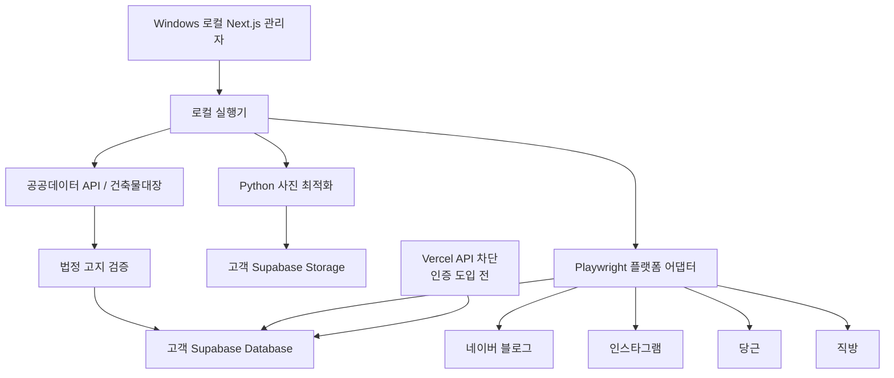

# 바를정 부동산 통합 매물 배포 시스템 PRD

기준 네이버 블로그 게시 형식: https://blog.naver.com/dhroom5555/224369047575

## 1. 문서 정보

- 상태: 구현 기준 확정본
- 최종 갱신일: 2026-08-30 (21절 변경 기록 추가)
- 대상: 바를정공인중개사사무소
- 핵심 매물: 경북대학교 인근 원룸, 투룸, 오피스텔
- 운영 PC: 고객 소유 Windows PC 1대
- 웹·DB: 고객 소유 Vercel·Supabase 계정
- 게시 계정: 네이버 블로그, 인스타그램, 당근, 직방 각 1개

## 2. 제품 정의

직원이 매물을 한 번 등록하면 건축물대장 기반 법정 고지사항을 자동으로 채우고, 고객 Windows PC의 로그인된 브라우저에서 Playwright가 여러 플랫폼에 게시하며, 관리자 화면에서 플랫폼별 결과를 확인하는 시스템이다.

## 3. 해결할 문제

- 같은 사진, 가격, 주소와 설명을 여러 플랫폼에 반복 입력한다.
- 플랫폼별 양식 차이로 누락과 오타가 발생한다.
- 공인중개사법상 표시·광고 명시사항을 매번 확인해야 한다.
- 모바일 원본 사진은 장당 약 10MB라 무료 Storage를 빠르게 소진한다.
- 플랫폼 로그인 세션과 추가 인증은 고객 PC에서 유지하는 편이 안정적이다.
- 플랫폼별 진행·성공·실패와 실제 게시물 링크를 한 화면에서 보기 어렵다.

통화기록 기능은 고객 결정에 따라 제품 범위에서 완전히 제외한다.

## 4. 목표

1. 직원·고객·매물 CRUD를 제공한다.
2. 주소로 공공데이터 API를 조회해 건축물대장 값을 가져온다.
3. 자동값과 직원 입력값을 결합해 법정 고지를 완성한다.
4. 필수 고지값이 누락되면 게시 작업을 차단한다.
5. 직원 작성 원고에 검증된 법정 고지를 강제로 붙인다.
6. 사진을 고객 PC의 Python에서 최적화한 뒤 Supabase로 직접 올린다.
7. 고객 PC의 Playwright가 플랫폼별 게시 작업을 실행한다.
8. 관리자에서 플랫폼별 대기·진행·완료·실패와 링크를 확인한다.
9. 새 Windows PC에서 클론 후 문서 순서대로 설치하고 로컬 화면을 연다.
10. 고객 계정의 Supabase와 Vercel에 별도로 이식한다.

## 5. 제외 및 후속 범위

- 통화기록, 휴대폰 앱 연동, DGHR 전사 기능
- 영상 저장·압축·게시
- 여러 사업장 또는 플랫폼별 다계정
- 고객-매물 자동 추천과 메시지 발송
- 런타임 AI 문구 생성과 Computer Use 상시 게시
- 현재 개발 PC의 로그인 세션, 경로, 키 또는 설정 재사용

다음은 고객과 별도 확정 후 추가한다.

- 관리자 로그인과 직원별 권한
- 모바일 매물 등록
- 플랫폼별 실제 Playwright 셀렉터와 게시 동작
- 사이트 개편 시 Codex를 이용한 어댑터 유지보수 절차

## 6. 운영 원칙

### Windows PC 우선

- 매물 등록, 사진 최적화, 공공데이터 조회와 게시 작업은 고객 Windows PC에서 수행한다.
- 모바일은 우선 조회 기능으로 제공하고, Vercel 고객 실데이터 접근은 관리자 인증 도입 전 차단한다.
- 로그인 세션은 고객 PC의 전용 Playwright 프로필에만 저장한다.
- 개발은 headed로 하고 안정화 후 headless로 전환한다.

### 고객 소유와 독립 설치

- Supabase, Vercel, 공공데이터 API, 플랫폼 계정과 키는 고객 소유다.
- 저장소에는 변수 이름과 빈 예제값만 포함한다.
- `.env`, `.env.local`, 토큰·인증 파일과 브라우저 프로필은 커밋하지 않는다.
- 개발자 계정명, 홈 디렉터리, 절대 경로를 코드에 넣지 않는다.

### AI 사용

- 정상 운영에는 AI를 호출하지 않는다.
- 게시글은 직원이 작성하고 플랫폼별 고정 템플릿으로 변환한다.
- 법정 고지는 검증된 데이터에서 결정적으로 생성한다.
- 사이트 변경으로 Playwright가 깨질 때만 Codex가 유지보수에 개입한다.

## 7. 아키텍처



### Next.js 관리자

- 대시보드, 직원관리, 고객관리, 매물관리, 설정
- 등록 마법사, 법정 고지 검증, 직원 원고 편집
- 플랫폼별 상태 자동 갱신과 개별 재시도
- 환경변수가 없으면 비식별 데모 데이터로 전 기능 작동
- 고객 Supabase 연결 시 동일 Repository 인터페이스로 전환
- 연결 방식(2026-08-30 확정): 브라우저는 고객 PC 로컬 Next 서버의 `/api/*` 만 호출하고, 서버가 service role 키로 Supabase 를 읽고 쓴다. 관리자 로그인 확정 전에도 고객 계정만 연결하면 동작하며, 로그인 도입 시 이 API 계층 위에 인증만 얹는다(21절 참고).

### Supabase

- 직원, 고객, 매물, 건축물대장, 법정 고지, 사진 메타데이터 저장
- 원고, 배포 작업, 플랫폼별 결과와 실행기 상태 저장
- 최적화 사진만 private Storage에 저장
- 상태 변경은 Realtime, 장애 시 5초 폴링
- public 테이블 전체 RLS, 인증 확정 전 익명 쓰기 차단

### Windows 실행기

- 대기 작업 획득, lease, heartbeat, idempotency와 재시도
- Python 사진 최적화 호출
- 주소 조회와 법정 고지 검증
- 플랫폼별 Playwright 어댑터 독립 실행
- 성공 URL, 완료 시각, 오류 코드와 재시도 횟수 저장

### Playwright 어댑터

공통 계약을 준비하고 실제 사이트 동작은 고객 PC에서 네이버, 인스타그램, 당근, 직방 순으로 붙인다. 각 어댑터는 로그인 확인, 게시, 결과 URL 확인과 오류 분류를 제공한다. 초기 구현은 `not_configured`를 반환해 실제 게시를 하지 않는다.

## 8. 매물 등록 흐름

1. 고객 Windows PC에서 사진과 기본 매물값을 입력한다.
2. Python이 사진을 순차 압축하고 EXIF를 제거한다.
3. 실행기가 주소로 건축물대장 API를 조회한다.
4. 여러 후보가 있으면 직원이 하나를 선택한다.
5. 자동값을 표시하고 직원이 확인한다.
6. 직원이 API에 없는 거래조건과 현장정보를 입력한다.
7. 필수 고지 검증 후 매물과 사진을 Supabase에 저장한다.
8. 직원이 공통 또는 플랫폼별 원고를 작성한다.
9. 검수 모드는 승인 후, 자동 모드는 저장 즉시 작업을 만든다.

## 9. 법정 고지사항

구현 시점의 최신 법령을 확인하며 기본 근거는 다음과 같다.

- 공인중개사법 제18조의2
- 공인중개사법 시행령 제17조의2
- 국토교통부 고시 「중개대상물의 표시·광고 명시사항 세부기준」

게시글 하단 `공인중개사법 시행령에 따른 명시사항`에는 다음을 표시한다.

- 소재지, 계약면적, 중개대상물 종류, 거래형태
- 해당 층·총 층수, 입주가능일, 방·욕실 수
- 사용승인일, 총 주차대수
- 관리비와 포함 항목
- 방향과 판단 기준
- 지번 공개 범위 안내, 면적 실측 차이 안내

| 출처 | 대표 항목 | 처리 원칙 |
|---|---|---|
| 공공데이터 | 소재지, 용도, 총 층수, 사용승인일, 주차, 면적 | 원본과 정규화 값을 함께 저장 |
| 직원 입력 | 가격, 거래형태, 해당 층, 입주일, 방·욕실, 관리비, 방향 | 필수 검증과 수정 이력 저장 |
| 혼합 확인 | 계약면적, 중개대상물 종류, 총 주차대수 | 자동값 제시 후 직원 확정 |

AI는 고지값을 만들거나 추측하지 않으며 고지 블록은 사용자가 삭제할 수 없다.

## 10. 사진 최적화

- JPEG, PNG, WebP 입력
- EXIF 방향 반영 후 메타데이터와 위치정보 제거
- 긴 변 기본 1920px, JPEG 품질 기본 82
- 목표 기본 800KB 이하, 최소 품질까지 단계 조정
- SHA-256, 해상도, 최적화 전후 용량 기록
- 원본은 Supabase에 올리지 않고 결과만 사진별로 직접 업로드
- 개별 실패 사진만 재시도 또는 제외

## 11. 배포와 상태

1. 실행기가 가장 오래된 작업을 lease로 획득한다.
2. 플랫폼 로그인 상태를 확인한다.
3. 어댑터가 사진과 사용자 원고를 입력한다.
4. 초기 headed, 안정화 후 headless로 실행한다.
5. 성공 URL·완료시각 또는 오류 코드·요약을 저장한다.
6. 실패 플랫폼만 개별 재시도한다.
7. 만료 lease는 대기 상태로 회수한다.

상태는 `not_requested`, `queued`, `running`, `succeeded`, `failed`, `cancelled`, `not_configured`로 구분한다. 목록의 플랫폼 아이콘은 상태를 표현하고 완료 시 실제 링크로 이동한다.

## 12. 메뉴

### 대시보드

- 전체 매물, 광고 중, 검토 대기, 배포 실패
- Windows 실행기 상태와 최근 등록 매물
- `오늘의 배포 레일`은 표시하지 않는다.

### 매물관리

- CRUD, 검색, 유형·가격·상태·플랫폼·등록자·등록일 필터
- 사진, 내부 정확 주소, 플랫폼별 공개 주소 정책
- 등록·수정 직원과 시각
- 상태: 등록 대기, 검토 완료, 광고 중, 계약 진행, 거래 완료, 보류, 종료

### 고객관리

- 이름, 전화번호, 문의 유형, 희망 조건, 메모, 다음 확인일 CRUD
- 통화기록과 휴대폰 연동 없음

### 직원관리

- 이름, 연락처, 직책, 재직상태, 등록일 CRUD

### 설정

- 검수/자동 발행, 플랫폼 연결 상태, 주소 공개 범위
- 실행기 상태, 사진 설정, 플랫폼별 원고 템플릿

## 13. 데이터 모델

- `offices`: 사업장 경계
- `employees`: 직원과 재직 상태
- `customers`: 고객 조건, 메모와 다음 확인일
- `properties`: 매물 기본정보, 거래조건, 상태와 등록자
- `property_status_history`: 상태 변경 이력
- `building_register_snapshots`: 공공데이터 원본·정규화 응답
- `legal_disclosures`: 확정 법정 고지 필드와 검증 상태
- `property_media`: Storage 경로, 순서, 크기, 해상도와 checksum
- `content_drafts`: 직원 작성 공통·플랫폼별 원고와 버전
- `distribution_jobs`: 배포 묶음, 모드, idempotency와 전체 상태
- `distribution_targets`: 플랫폼별 상태, 오류와 게시 URL
- `distribution_events`: 상태 변경 감사 로그
- `local_agents`: 실행기 버전, 상태와 heartbeat
- `platform_connections`: 플랫폼 연결·로그인 상태
- `app_settings`: 배포, 주소 공개, 사진과 템플릿 설정

모든 업무 행은 `office_id`로 분리하고 UUID 기본키와 감사 시각을 가진다.

## 14. 보안

- public 테이블 전체 RLS, `anon` 업무 데이터 접근 금지
- 향후 `app_metadata.office_id`와 역할로 권한 적용
- `user_metadata`를 권한 판단에 사용하지 않음
- service role과 공공데이터 키를 브라우저에 노출하지 않음 — service role 은 고객 PC 로컬 Next 서버(Route Handler)와 Windows 실행기, Python 업로더만 사용
- Storage는 private, 로그인 프로필은 고객 PC 저장소 밖 경로
- 인증 확정 전 Vercel 관리자 API와 공공데이터 API의 읽기·쓰기 전체 차단

## 15. 오류와 복구

- 공공데이터 실패: 제한 재시도 후 수동 확인, 필수값 미완료 시 게시 차단
- 다중 건축물: 직원 선택과 식별자 저장
- 사진 실패: 원본 업로드 금지, 개별 재시도
- 로그인 만료: 해당 플랫폼만 실패, headed 재로그인
- 실행기 중단: lease 회수와 idempotency 중복 방지
- 사이트 변경: `selector_changed`, 해당 어댑터만 재학습
- CAPTCHA: 자동 우회하지 않고 사용자 조치 상태

## 16. 고객 PC 독립 설치

README는 Windows 11 빈 PC에서 다음을 안내한다.

1. Git, Node.js 24 LTS, Python 3.13 설치
2. 저장소 클론
3. Node 의존성과 Python 가상환경·고정 의존성 설치
4. Playwright Chromium 설치
5. Supabase CLI·Vercel CLI 최신판 설치
6. 환경변수 예제 복사 후 고객 값 입력
7. 관리자와 실행기 시작, 로컬 브라우저 열기
8. 고객 Supabase 연결과 전체 migration 적용
9. headed Playwright로 플랫폼별 로그인·동작 학습
10. 테스트 후 고객 Vercel 연결·Preview·Production 배포

설치 스크립트는 선행 프로그램과 버전을 검사하고 공식 설치 명령을 안내한다. 개인 PC 절대 경로나 기존 인증정보를 가정하지 않는다.

## 17. Supabase·Vercel 이식

저장소는 `supabase/config.toml`, `schemas`, `migrations`, `seed.sql`, DB 테스트와 타입 생성 명령을 포함한다. 고객 DB 적용은 다음 세 명령을 기준으로 한다.

```powershell
supabase login
supabase link --project-ref <CUSTOMER_PROJECT_REF>
supabase db push
```

Vercel은 고객 계정에서 최신 CLI로 로그인·연결하고, `vercel env`로 고객이 값을 넣은 뒤 Preview를 검수하고 Production에 배포한다. 실제 참조값과 키는 커밋하지 않는다.

## 18. 테스트와 합격 기준

- TypeScript: 고지 검증, 템플릿, 상태 전이, 필터와 CRUD
- React: 등록 마법사와 주요 모달
- 웹 Playwright: 관리자 핵심 흐름과 반응형 조회
- Supabase: 제약, 트리거, lease, idempotency, RLS와 advisor
- Python: EXIF 제거, 해상도, 목표 용량과 checksum
- 실행기: heartbeat, 작업 획득, 오류 분류, 재시도와 어댑터 계약
- 새 디렉터리 clone smoke test, production build
- 비밀값·절대 경로·개인 계정 문자열 검사

환경변수 없이 데모 모드가 동작하고, 고객 DB에 migration을 한 번에 적용할 수 있으며, 실제 플랫폼 미연결 시 안전하게 `not_configured`로 종료해야 한다.

## 19. 단계

1. 저장소 완성: 관리자, Supabase, Python, 실행기, 문서와 비공개 GitHub
2. 고객 PC 이식: 필수 프로그램, 고객 환경변수, DB migration과 local smoke test
3. 플랫폼 연결: 한 사이트씩 headed 학습·회귀 테스트 후 headless 전환
4. 정식 배포: 인증 정책 적용, 고객 Vercel Preview 검수 후 Production

## 20. 남은 고객 결정

- 관리자 로그인 방식과 직원 권한
- 최종 공공데이터 API와 발급 절차
- 원본 사진 보존기간과 거래 완료 사진 삭제 시점
- 모바일 등록 여부와 플랫폼별 주소 공개 기본값
- CAPTCHA·추가 인증 담당자

이 결정은 설정 또는 독립 모듈로 추가하며 핵심 DB와 실행기 계약을 변경하지 않는다.

## 21. 변경 기록 — 2026-08-30 고객 Supabase 연결 (Claude 작업, Codex 대조용)

대표 지시: "supabase 계정만 연결하면 바로 작동할 수준까지", "파워셸 UTF-8 수정", "플랫폼 어댑터는 빈 껍데기 유지(고객 PC에서 Playwright 로 직접 연결)".

### 21.1 구조 결정

- RLS 정책이 `authenticated` + `app_metadata.office_id` 를 요구하는데 관리자 로그인은 20절 미결정 항목이라 브라우저가 Supabase 에 직접 붙을 수 없다.
- 따라서 **고객 PC 의 로컬 Next 서버가 서버 전용 키(`SUPABASE_SERVICE_ROLE_KEY`)로 Supabase 에 접근**하고, 브라우저는 `localhost/api/*` 만 호출한다. 키는 `.env.local` 에만 있고 브라우저 번들에 들어가지 않는다.
- `NEXT_PUBLIC_SUPABASE_*` 는 화면 코드에서 사용하지 않는다(로그인 도입 후 브라우저 직접 접속용으로 이름만 유지).
- 당시에는 `BARJUNG_READ_ONLY=true` 로 Vercel 저장 요청만 막았다. 22절 재검증에서 무인증 읽기 노출을 확인해 Vercel API 전체 차단으로 대체했다.
- 실시간 반영은 Realtime 대신 폴링: 화면 전체 5초, 배포 모달 2초(브라우저에 인증 세션이 없어 Realtime 구독 불가).

### 21.2 파일별 변경

| 구분 | 파일 | 내용 |
|---|---|---|
| 신규 | `src/lib/supabase/server.ts` | service role 클라이언트 생성(`readServerConfig`, `isReadOnly`, `createServiceClient`). 브라우저에서 호출되면 throw |
| 신규 | `src/lib/supabase/mappers.ts` | DB 행 ↔ 화면 모델 순수 변환. 매물 유형·상태·재직 enum, 만원↔원, KST 날짜 표기, 다음 확인일 파싱, 법정 고지 13열, 플랫폼별 최신 배포 대상(`latestTargetsForProperty`), 실행기 온라인 판정(30초) |
| 신규 | `src/lib/supabase/workspace.ts` | 데이터 서비스. 스냅샷 조회, 매물 CRUD(매물번호 `YYMMDD-NN` 채번, `legal_disclosures` upsert, `content_drafts` 플랫폼별 버전 관리), 고객·직원 CRUD, 설정 upsert, 배포 요청(`distribution_jobs` + `distribution_targets`, 멱등키 `매물:플랫폼:분`) |
| 신규 | `src/lib/api/server.ts` | Route Handler 공통(`withLive`): 미설정 503 `NOT_CONFIGURED`, 조회 전용 403 `READ_ONLY`, 오류 400 정제 |
| 신규 | `src/app/api/workspace/route.ts` | GET 스냅샷 |
| 신규 | `src/app/api/{properties,customers,employees}/route.ts` + `[id]/route.ts` | GET/POST, GET/PATCH/DELETE |
| 신규 | `src/app/api/settings/route.ts` | GET/PATCH |
| 신규 | `src/app/api/distribution/route.ts` | POST `{propertyId, platforms?}` |
| 신규 | `src/lib/api/client.ts` | 브라우저용 저장소(`createApiRepository`), 연결 판별(`connectRepository`: 503 이면 데모) |
| 수정 | `src/lib/domain/types.ts` | `PLATFORMS`, `EmploymentStatus`(퇴사 추가), `Property.registeredById/copies`, `Customer.followUpAt`, `OfficeInfo`, `AgentStatus`, `WorkspaceSnapshot`, `defaultSettings` |
| 수정 | `src/lib/domain/repository.ts` | `BarjungRepository` 에 `mode`, `loadWorkspace`, `getProperty`, `requestDistribution(id, platforms?)`, `updateSettings` 추가. 데모 구현 갱신 |
| 분리 | `src/components/barjung-app.tsx` → `src/components/app/*` | 257줄 단일 파일을 `ui`, `shell`, `dashboard`, `properties-view`, `property-wizard`, `distribution-modal`, `customers-view`, `employees-view`, `settings-view`, `entity-modals`, `use-workspace` 로 분리. 승인된 클래스명·시각 언어 유지 |
| 수정 | 화면 동작 | 하드코딩 제거: 사이드바 매물 수·프로필·실행기 상태, 상단 날짜(KST), 배포 실패 문구, 직원별 등록 매물 수, 저장공간 문구. 상단에 모드 배지. 마법사 입력값이 실제 저장됨(제목·유형·금액·주소·등록 직원·거래형태). 라이브 모드 마법사는 예시값 없이 빈 폼, 사진 단계는 CLI 안내. 매물 상세에 사진 업로드 명령(사업장·매물 ID 포함). 저장 실패는 모달 안 + 빨간 토스트 |
| 수정 | `src/app/globals.css` | 모드 배지·오프라인 점·로딩·코드 블록·빈 목록 스타일 추가(끝부분) |
| 수정 | `python/barjung_media/cli.py` | `expand_images`: 와일드카드·폴더 입력 처리(PowerShell 미확장 대응) |
| 수정 | `scripts/*.ps1` (5개) | UTF-8 BOM 추가 — Windows PowerShell 5.1 한글 깨짐·구문 오류 방지 |
| 수정 | `playwright.config.ts` | 전용 포트 3100, 기존 서버 재사용 금지, 데모 모드 강제 |
| 수정 | `package.json` | `@supabase/supabase-js@2.112.4` 추가(runner 와 동일 버전) |
| 수정 | `.env.example`, `README.md`, `docs/CUSTOMER_INSTALL.md`, `docs/DEPLOYMENT.md` | 연결 절차·모드·조회 전용 배포 반영 |
| 신규 | `src/test/fake-supabase.ts` | 테스트용 메모리 Supabase(체인·unique 위반 23505·cascade) |
| 신규 | `src/lib/supabase/{workspace,mappers}.test.ts`, `src/components/barjung-app.test.tsx`(라이브 모드 케이스 추가), `python/tests/test_optimizer.py`(와일드카드) | 검증 |

### 21.3 변경하지 않은 것

- `supabase/migrations`, `schemas`, `seed.sql` — 스키마는 그대로 사용. 새 열·테이블 없음.
- `runner/` — 실행기·어댑터 코드 무변경. 화면이 만드는 `distribution_targets` 를 기존 `claim_distribution_target` RPC 가 그대로 가져간다.
- 네 플랫폼 어댑터는 계속 `not_configured`.

### 21.4 검증 결과 (2026-08-30, 개발 맥)

- `npm test` 29/29, `npm run build` 성공(API 라우트 10개), `npx playwright test` 4/4, `pytest` 4/4, runner 5/5·typecheck 통과.
- 실서버 기동 확인: 연결값 없음 → `/api/workspace` 503 `NOT_CONFIGURED`; 연결 불가 URL → 500 JSON 정제; 조회 전용 → 저장 403.
- **미검증**: 실제 Supabase 프로젝트 대상 왕복. 개발 맥에 Docker 가 없어 로컬 Supabase 를 띄우지 못했고 개발용 원격 프로젝트도 없다. 데이터 서비스는 가짜 클라이언트(`src/test/fake-supabase.ts`)로 같은 쿼리 체인을 검증했다. 고객 PC 첫 연결 때 "고객 DB 연결" 배지·실행기 온라인·매물 1건 등록·전체 배포(4건 `not_configured`) 를 실측해야 한다.

### 21.5 알려진 한계·후속

- 다음 확인일: 라이브 모드는 날짜·시간 입력, 데모 모드는 자유 문자열.
- 매물 상세의 사진 수는 `property_media` 행 수이며 실제 이미지는 화면에 표시하지 않는다(private 버킷 서명 URL 은 로그인 도입 후).
- `app_settings.platform_settings.address_policy` 에 플랫폼별 주소 공개 범위를 저장하지만, 게시 시 주소 가공은 어댑터 연결 때 구현한다.
- 저장소가 비공개라 고객 클론은 공개 전환 또는 초대가 필요하다(대표 처리).

## 22. 변경 기록 — 2026-08-30 Codex 재검증 보완

- 관리자 인증 전 Vercel 런타임의 `/api/*` 고객 데이터 및 공공데이터 호출을 403 `REMOTE_ACCESS_DISABLED` 로 차단했다. 고객 실데이터는 Windows PC의 `localhost`에서만 사용한다.
- `/api/workspace`의 명시적인 503 `NOT_CONFIGURED`만 데모 모드로 전환한다. DB·서버·네트워크 오류는 오류 화면에 남긴다.
- 일자별 매물번호는 당일 행 개수가 아니라 사용한 최대 순번 다음 값으로 채번해 중간 삭제 뒤 유일성 충돌을 막는다.
- 매물 수정 화면에서 네이버·인스타그램·당근·직방 원고를 각각 편집해 `copies`에 저장한다.
- 사진 Storage 객체와 `property_media` 메타데이터를 재실행 가능한 upsert로 저장한다.
- 고객 Windows의 `setup-windows.ps1`은 Vercel CLI를 항상 `vercel@latest`로 설치·갱신한다.
