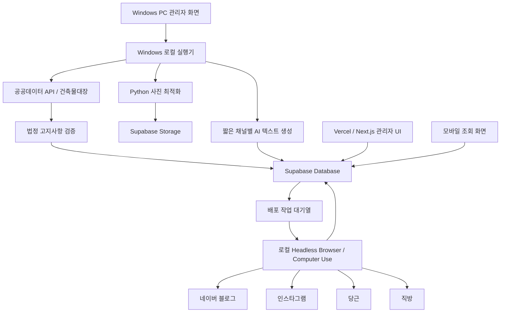

# 바를정 부동산 통합 매물 배포 시스템 PRD

## 1. 문서 정보

- 문서 상태: 고객 시안용 PRD 초안
- 작성일: 2026-08-29
- 대상 사업장: 바를정공인중개사사무소
- 핵심 지역/매물: 경북대학교 인근 원룸, 투룸, 오피스텔
- 1차 산출물: 고객 확인용 인터랙티브 목업
- 1차 운영 원칙: Windows PC에서 매물을 등록하고 모바일은 조회 전용으로 제공

## 2. 제품 한 줄 정의

직원이 매물 정보를 한 번 등록하면 건축물대장 기반 법정 고지사항을 자동으로 채우고, 채널별 짧은 게시글을 생성한 뒤 고객의 Windows PC에서 네이버 블로그, 인스타그램, 당근, 직방 등에 자동 등록하는 부동산 업무 시스템이다.

## 3. 배경과 문제

바를정 부동산은 같은 매물의 사진, 가격, 주소, 상세 설명과 법정 고지사항을 여러 플랫폼에 반복 입력해야 한다. 플랫폼마다 입력 형식이 다르고 로그인 상태를 유지해야 하며, 일부 값은 건축물대장에서 확인해야 한다.

현재 업무의 주요 문제는 다음과 같다.

- 하나의 매물을 여러 SNS와 부동산 플랫폼에 반복 등록해야 한다.
- 플랫폼별 입력 형식이 달라 누락과 오타가 발생하기 쉽다.
- 공인중개사법상 표시·광고 명시사항을 매번 확인하고 입력해야 한다.
- 고용량 모바일 원본 사진을 그대로 저장하면 Supabase 무료 저장공간을 빠르게 소진한다.
- 플랫폼 로그인과 추가 인증 때문에 일반적인 클라우드 브라우저 자동화가 불안정할 수 있다.
- 배포 성공 여부와 실제 게시물 링크를 한 화면에서 확인하기 어렵다.
- 고객 상담과 통화 이력이 매물 업무와 분리되어 있다.

## 4. 목표

### 4.1 핵심 목표

1. 매물 정보를 한 번만 입력한다.
2. 주소를 기준으로 공공데이터 API에서 건축물대장 값을 조회한다.
3. 자동 조회값과 직원 입력값을 결합해 법정 필수 고지사항을 완성한다.
4. 필수값이 누락되면 배포를 차단한다.
5. 검증된 데이터로 플랫폼별 짧은 게시글을 생성한다.
6. 고객 Windows PC의 로그인된 브라우저를 사용해 플랫폼별 등록을 수행한다.
7. 플랫폼별 완료, 실패, 결과 링크를 관리자 화면에서 확인한다.
8. 사진은 Supabase에 업로드하기 전에 Windows 로컬 Python으로 최적화한다.

### 4.2 고객 시안 목표

- 직원, CRM, 매물관리, 설정 화면을 모두 클릭할 수 있어야 한다.
- 매물 등록부터 법정 정보 조회, 게시글 생성, 배포 완료까지 전체 흐름을 시연해야 한다.
- 실제 공공데이터, AI, Supabase, SNS 계정을 연결하지 않고 현실적인 가상 데이터로 동작해야 한다.
- 플랫폼별 배포 진행, 실패, 재시도, 완료 링크를 시뮬레이션해야 한다.
- 데스크톱과 모바일 화면을 모두 제공하되 모바일 매물 등록은 1차 범위에서 제외한다.

## 5. 비목표

다음 항목은 고객 시안과 1차 운영 범위에 포함하지 않는다.

- 실제 SNS 계정 로그인 및 실제 게시물 발행
- 실제 휴대폰 통화기록 동기화
- 로그인과 사용자별 권한 제어
- 고객 조건과 신규 매물 자동 매칭
- 고객 대상 문자 또는 카카오톡 자동 발송
- 영상 업로드 및 영상 최적화
- 여러 사업장 또는 플랫폼별 다계정 지원
- 클라우드 브라우저에서 SNS 로그인 세션 유지

## 6. 사용자와 권한

### 6.1 목업

- 단일 관리자 관점으로 모든 메뉴와 데이터를 조회한다.
- 로그인과 권한 차이는 표현하지 않는다.

### 6.2 실제 운영 전 필수 결정

- 인터넷에 공개된 관리자 화면에서 Supabase 쓰기 권한을 익명 사용자에게 부여하지 않는다.
- 실제 쓰기 기능을 배포하기 전에 로그인 또는 승인된 기기 인증을 추가해야 한다.
- 권한을 추가할 경우 대표/관리자와 일반 직원의 2단계 권한을 기본안으로 검토한다.

## 7. 확정 아키텍처

### 7.1 구성

### 7.2 역할 분리

#### Vercel / Next.js

- 관리자 UI 호스팅
- 정적 또는 클라이언트 중심 화면 제공
- 서버 측 사진 압축을 수행하지 않음
- 장시간 SNS 자동화를 수행하지 않음

#### Supabase

- 직원, 고객, 통화기록, 매물, 법정 고지사항 저장
- 최적화된 사진 저장
- 플랫폼별 배포 작업과 결과 저장
- Realtime을 통한 진행 상태 전달
- Realtime 장애 시 폴링을 위한 조회 API 제공

#### Windows 로컬 실행기

- 고객 Windows PC에서 상시 또는 필요 시 실행
- 고객 소유 API 키와 SNS 로그인 세션 보관
- 로컬 Python 사진 최적화
- 공공데이터 API 호출
- AI용 입력 데이터 구성 및 짧은 텍스트 생성
- 개발 단계에서는 headed 브라우저로 동작 검증
- 운영 안정화 후 headless 브라우저로 플랫폼별 병렬 등록
- 플랫폼별 성공, 실패 사유, 게시물 URL을 Supabase에 반영
- 주기적인 heartbeat로 온라인 상태 전달

#### voucher 공용 패키지

- 주소 정규화
- 공공데이터 API 요청
- 건축물 후보 선택
- 건축물대장 응답 파싱
- 법정 고지 필드 매핑
- 코드만 공용화하며 API 키와 고객 데이터는 공유하지 않음

## 8. 핵심 업무 흐름

### 8.1 매물 등록

1. 직원이 Windows PC에서 신규 매물 등록을 연다.
2. 사진, 주소, 가격과 핵심 조건을 입력한다.
3. 사진은 아직 Supabase에 업로드하지 않는다.
4. 로컬 Python이 사진을 순차적으로 압축하고 EXIF를 제거한다.
5. 로컬 실행기가 주소를 공공데이터 API에 전달한다.
6. 여러 건축물이 반환되면 직원이 대상 건축물을 선택한다.
7. 건축물대장 자동 조회값을 화면에 표시한다.
8. API에 없는 거래조건과 현장정보를 직원이 입력한다.
9. 필수 고지사항 검증을 통과해야 등록 버튼이 활성화된다.
10. 최적화된 사진과 검증된 매물 데이터를 Supabase에 저장한다.
11. 플랫폼별 콘텐츠 생성 및 배포 작업을 생성한다.

### 8.2 법정 고지사항 생성

법적 근거는 다음 문서를 기준으로 구현 시점에 다시 확인한다.

- 공인중개사법 제18조의2
- 공인중개사법 시행령 제17조의2
- 국토교통부 고시 「중개대상물의 표시·광고 명시사항 세부기준」

블로그 기준 표시 항목은 다음과 같다.

- 소재지
- 계약면적
- 중개대상물 종류
- 거래형태
- 해당 층수와 총 층수
- 입주가능일
- 방 수와 욕실 수
- 사용승인일
- 총 주차대수
- 관리비와 포함 항목
- 방향과 방향 판단 기준
- 지번 비공개 사유 또는 안내 문구
- 면적 실측 차이 안내 문구

건축물대장에서 가져올 수 있는 값과 직원 입력값을 구분한다.

| 구분 | 대표 항목 | 처리 원칙 |
|---|---|---|
| 공공데이터 자동값 | 소재지, 건축물 용도, 총 층수, 사용승인일, 주차 관련 값, 면적 관련 값 | 원본 응답과 정규화 값을 함께 저장 |
| 직원 입력값 | 가격, 거래형태, 해당 층, 입주가능일, 방/욕실 수, 관리비, 방향 | 필수값 검증 및 수정 이력 저장 |
| 혼합 또는 확인 필요 | 계약면적, 중개대상물 종류, 주차대수 | 공공데이터 값 제시 후 직원 확인 |

AI는 법정 고지값을 생성하거나 추측하지 않는다. 프로그램이 검증된 고지값을 게시글 하단에 강제로 삽입하며, AI가 반환한 고지값이 있더라도 사용하지 않는다.

### 8.3 사진 최적화

- 원본 사진은 Windows PC 로컬에서 읽는다.
- Python 기반 최적화를 수행한 뒤 Supabase Storage로 직접 업로드한다.
- 압축은 사진별로 순차 처리하고 업로드도 개별 수행한다.
- EXIF 위치정보와 불필요한 메타데이터를 제거한다.
- 긴 변 기준 크기, JPEG 품질, 목표 용량은 실제 사진 품질 테스트 후 확정한다.
- 1차 권장 목표는 사진당 약 500~800KB이다.
- 원본 보존 여부와 로컬 보존기간은 운영 설정으로 둔다.
- Supabase Free Storage 1GB를 고려해 거래 완료 매물의 사진 정리 정책이 필요하다.

예상 저장량은 사진 10장, 장당 500~800KB 기준 매물당 약 5~8MB이다. 기타 파일과 여유 공간을 제외하면 약 100~160개 매물을 동시에 보관하는 수준을 1차 운영 목표로 삼는다.

### 8.4 콘텐츠 생성

AI 입력은 다음 데이터로 제한한다.

- 검증된 건축물대장 값
- 직원이 입력하고 확인한 거래조건
- 사진 분석에서 얻은 제한적인 특징
- 플랫폼별 고정 템플릿
- 금지 표현 및 허위·과장 방지 규칙

플랫폼별 출력은 짧은 테스트 문구를 기본으로 한다.

- 네이버 블로그: 제목, 짧은 소개, 핵심 조건, 사진 사이 설명, 문의 정보, 법정 고지사항
- 인스타그램: 짧은 소개, 핵심 조건, 문의 유도, 해시태그
- 당근: 지역 중심 제목, 가격과 조건, 핵심 특징, 문의 정보
- 직방: 플랫폼 입력 필드에 맞춘 구조화 값과 짧은 설명

초기 운영 일주일은 모든 채널의 미리보기를 직원이 확인하고 수정한 뒤 배포한다. 이후 대표가 설정 화면에서 자동 발행 모드로 직접 전환한다. 언제든 검수 모드로 되돌릴 수 있어야 한다.

### 8.5 SNS 배포

1. 로컬 실행기가 대기 중인 배포 작업을 가져온다.
2. 플랫폼별 로그인 세션 유효성을 확인한다.
3. 각 플랫폼 어댑터가 정해진 입력 양식에 데이터를 배치한다.
4. 초기 개발은 브라우저가 보이는 headed 방식으로 검증한다.
5. 안정화 이후 headless 방식으로 전환한다.
6. 가능한 채널은 병렬로 실행하되 플랫폼별 작업 상태는 독립적으로 관리한다.
7. 성공 시 실제 게시물 URL과 완료 시간을 저장한다.
8. 실패 시 간단한 실패 사유를 저장한다.
9. 사용자는 실패한 플랫폼만 개별 재시도할 수 있다.

플랫폼별 계정은 각각 하나만 연결한다.

- 네이버 계정 1개
- 인스타그램 계정 1개
- 당근 계정 1개
- 직방 계정 1개

### 8.6 Windows PC 오프라인

- 실행기가 오프라인이어도 매물과 작업 상태는 Supabase에 보존한다.
- 관리자 화면에 실행기 오프라인 상태와 대기 작업 수를 표시한다.
- 실행기가 재연결되면 오래된 순서대로 자동 실행한다.
- 같은 작업이 두 번 실행되지 않도록 작업 잠금과 idempotency key를 사용한다.

### 8.7 상태 자동 갱신

- 기본은 Supabase Realtime으로 변경 상태를 즉시 반영한다.
- Realtime 연결이 끊기면 3~5초 폴링으로 자동 전환한다.
- 매물 목록에서는 플랫폼별 상태 배지만 표시한다.
- 상태는 미배포, 대기, 진행 중, 완료, 실패로 구분한다.
- 완료 배지를 누르면 실제 게시물 링크로 이동한다.
- 실패 배지를 누르면 실패 사유와 해당 플랫폼 재시도 버튼을 표시한다.

## 9. 정보 구조와 메뉴

### 9.1 대시보드

매물 현황을 우선한다.

- 전체 매물
- 신규/등록 대기
- 검토 완료
- 광고 중
- 계약 진행
- 거래 완료
- SNS 미배포
- SNS 실패
- Windows 실행기 온라인 상태
- 최근 등록 매물

### 9.2 직원관리

- 직원 목록
- 직원 등록
- 직원 수정
- 직원 비활성화 또는 삭제
- 이름, 연락처, 직책, 재직상태, 등록일
- 목업에서는 권한 차이를 적용하지 않음

### 9.3 고객관리 CRM

- 고객 목록과 CRUD
- 전화번호, 이름, 문의 유형, 희망 매물조건, 메모, 후속 연락일
- 고객별 통화 이력
- 최근 상담과 후속 연락 예정 목록

### 9.4 통화기록

- 실제 연동은 추후 DGHR과 동일한 휴대폰 앱 + PC 연결 방식으로 구현
- 목업에서는 대표 휴대폰의 가상 통화기록을 사용
- 미등록 번호에서 고객 등록을 누르면 전화번호와 통화시간 자동 입력
- 기존 번호는 기존 고객의 통화 이력에 자동 추가

### 9.5 매물관리

- CRUD 테이블
- 매물번호와 주소 검색
- 원룸, 투룸, 오피스텔 유형 필터
- 보증금과 월세 범위 필터
- 매물 상태 필터
- SNS 배포 여부와 실패 필터
- 등록자 필터
- 등록일 필터
- 플랫폼별 상태 배지
- 누가 언제 등록했는지 표시

매물 상태는 다음과 같다.

`등록 대기 → 검토 완료 → 광고 중 → 계약 진행 → 거래 완료`

예외 상태로 `보류`, `종료`를 제공한다.

### 9.6 설정

- 검수 후 배포/자동 발행 모드 전환
- 플랫폼 연결 상태
- 플랫폼별 외부 주소 공개 범위
- Windows 실행기 연결 상태
- 사진 최적화 설정
- 플랫폼별 기본 템플릿

## 10. 외부 주소 공개

- 내부 데이터에는 정확한 주소를 저장한다.
- 플랫폼마다 주소 공개 수준을 별도로 설정한다.
- 전체 지번, 동 단위, 비공개 중 선택할 수 있다.
- 중개의뢰인이 지번 공개를 원하지 않을 때 안내 문구를 자동 삽입한다.
- 공공데이터 조회와 내부 업무에는 정확한 주소를 사용한다.

## 11. 핵심 데이터 모델

### employees

- id
- name
- phone
- position
- employment_status
- created_at

### customers

- id
- name
- phone
- inquiry_type
- desired_conditions
- memo
- follow_up_at
- created_at
- updated_at

### call_logs

- id
- customer_id
- phone
- direction
- started_at
- duration_seconds
- memo
- source_device

### properties

- id
- property_number
- property_type
- status
- exact_address
- public_address_policy
- deposit
- monthly_rent
- maintenance_fee
- maintenance_fee_details
- available_from
- room_count
- bathroom_count
- direction
- direction_basis
- registered_by
- created_at
- updated_at

### building_register_snapshots

- id
- property_id
- source
- source_identifier
- raw_response
- normalized_fields
- fetched_at
- confirmed_at
- confirmed_by

### legal_disclosures

- id
- property_id
- location
- contract_area
- property_category
- transaction_type
- floor_current
- floor_total
- available_from
- room_count
- bathroom_count
- approval_date
- parking_count
- maintenance_fee_text
- direction_text
- lot_number_disclosure_text
- measurement_notice
- validation_status

### property_media

- id
- property_id
- storage_path
- sort_order
- optimized_size_bytes
- width
- height
- checksum
- created_at

### distribution_jobs

- id
- property_id
- mode
- overall_status
- idempotency_key
- requested_at
- started_at
- completed_at

### distribution_targets

- id
- distribution_job_id
- platform
- status
- generated_text
- error_summary
- retry_count
- published_url
- started_at
- completed_at

### local_agents

- id
- device_name
- platform
- version
- status
- last_heartbeat_at

## 12. 오류와 복구

### 공공데이터 조회 실패

- 자동 재시도 후 실패 상태 표시
- 기존 조회값을 임의로 재사용하지 않음
- 직원이 다시 조회하거나 수동 입력 후 출처를 표시
- 필수 검증을 통과하지 못하면 배포 차단

### 주소에 여러 건축물 존재

- 후보 목록을 표시하고 직원이 선택
- 선택한 건축물 식별자를 스냅샷에 저장

### 사진 압축 실패

- 실패한 사진만 표시
- 원본 파일을 Supabase에 그대로 올리지 않음
- 해당 사진 제거 또는 재시도 후 등록 진행

### AI 생성 실패

- 고지사항과 매물 원본은 보존
- 해당 플랫폼 텍스트만 재생성
- AI 실패가 법정 정보 손실로 이어지지 않도록 분리

### 플랫폼 로그인 만료

- 해당 플랫폼만 실패 처리
- headed 모드에서 직원이 다시 로그인
- 로그인 확인 후 해당 플랫폼만 재시도

### 로컬 실행기 중단

- 진행 중 작업의 lease 만료 후 대기 상태로 복구
- 동일 게시물의 중복 등록을 막기 위해 게시 전후 확인 단계 적용

## 13. 보안과 개인정보

- 모든 API 키와 SNS 세션은 고객 소유다.
- API 키 값은 저장소에 커밋하지 않는다.
- 환경변수 파일의 값은 자동화 에이전트가 읽거나 출력하지 않는다.
- Supabase service role 또는 비밀 키를 브라우저에 노출하지 않는다.
- 로컬 실행기 비밀값은 고객 Windows PC의 환경설정 또는 OS 보안 저장소에 둔다.
- 고객 전화번호, 통화기록, 정확한 매물 주소는 개인정보 또는 민감 업무정보로 취급한다.
- 실제 운영 전에 인증, RLS, 접근 로그, 삭제 정책을 확정한다.
- Supabase 공개 스키마의 모든 테이블에 RLS를 적용한다.
- SNS 게시물에 공개할 주소는 플랫폼별 공개 설정을 따른다.

## 14. 무료 플랜 대응

- Vercel에서 사진 압축이나 장시간 작업을 수행하지 않는다.
- 관리자 화면은 가벼운 Next.js UI로 유지한다.
- 원본 사진은 Supabase에 저장하지 않는다.
- 최적화된 사진만 개별 업로드한다.
- Supabase Storage 1GB 사용량을 관리자 설정 또는 대시보드에서 확인할 수 있게 한다.
- 거래 완료/종료 매물의 사진을 로컬 보관 후 Supabase에서 정리하는 정책을 추후 확정한다.
- Realtime 메시지가 과도해지지 않도록 상태 변경 이벤트만 기록한다.
- 진행 애니메이션을 위해 불필요한 상태 쓰기를 반복하지 않는다.

## 15. 목업 화면과 시연 시나리오

### 15.1 화면

1. 매물 현황 중심 대시보드
2. 직원 목록/등록/수정 모달
3. 고객 목록/상세/등록/수정
4. 통화기록과 통화 후 고객 등록
5. 매물 목록과 헤더 필터
6. Windows PC용 매물 등록 마법사
7. 주소 조회와 건축물 선택
8. 법정 고지사항 자동 채움 및 누락 검증
9. 사진 로컬 압축 시뮬레이션
10. 채널별 AI 원고 미리보기
11. 플랫폼별 배포 진행 모달
12. 실패 사유와 개별 재시도
13. 설정과 자동 발행 모드 전환
14. 모바일 조회 화면

### 15.2 대표 시나리오

1. 사용자가 매물 목록에서 신규 등록을 누른다.
2. 원본 사진 10장을 선택한다.
3. 로컬 Python 최적화가 진행되는 것처럼 표시한다.
4. 주소를 입력하고 건축물대장을 조회한다.
5. 소재지, 용도, 총 층수, 사용승인일, 주차 정보가 자동 입력된다.
6. 사용자가 가격, 해당 층, 방/욕실 수, 관리비, 방향을 입력한다.
7. 누락 필드가 있을 때 배포가 차단되는 모습을 보여준다.
8. 누락값을 입력하면 고지사항 검증이 완료된다.
9. 플랫폼별 짧은 원고가 생성된다.
10. 전체 배포를 누르면 네이버, 인스타, 당근, 직방이 각각 진행된다.
11. 한 플랫폼은 실패시키고 나머지는 완료 처리한다.
12. 실패 플랫폼만 재시도해 완료한다.
13. 완료 배지를 눌러 가상 게시물 링크를 확인한다.

## 16. 목업 합격 기준

- 모든 주요 메뉴가 클릭 가능하다.
- 직원과 고객 CRUD가 가상 데이터로 동작한다.
- 통화 후 고객 등록 흐름이 동작한다.
- 매물 테이블 필터가 실제로 결과를 변경한다.
- 사진 압축, 주소 조회, 법정 정보 자동 채움이 단계적으로 표현된다.
- 필수 고지사항이 누락되면 배포 버튼이 비활성화된다.
- 플랫폼별 AI 원고가 서로 다른 형식으로 표시된다.
- 전체 배포 진행률과 플랫폼별 상태가 자동으로 변한다.
- 실패 플랫폼 개별 재시도가 동작한다.
- 완료 후 결과 링크를 누를 수 있다.
- 모바일에서는 대시보드, 매물 목록, 매물 상세와 배포 상태를 조회할 수 있다.
- 실제 API 키, 고객 개인정보, 실제 SNS 계정을 사용하지 않는다.

## 17. 테스트 전략

### 목업

- 데스크톱 주요 클릭 경로 수동 검증
- 모바일 반응형 화면 검증
- 가상 CRUD와 필터 동작 검증
- 배포 성공/실패/재시도 시나리오 검증
- 필수 고지사항 누락 차단 검증

### 실제 구현

- voucher 공용 패키지 필드 매핑 단위 테스트
- 다양한 주소와 다중 건축물 응답 테스트
- 고지사항 필수값 검증 테스트
- 사진 압축 품질과 용량 회귀 테스트
- 작업 잠금과 중복 실행 방지 테스트
- 플랫폼별 headed 자동화 회귀 테스트
- headless 전환 후 결과 동일성 테스트
- 로그인 만료와 CAPTCHA 발생 시 수동 복구 테스트
- Supabase RLS와 Storage 정책 테스트

## 18. 단계별 출시

### 단계 0: 고객 확인용 목업

- 모든 기능을 가상 데이터로 시뮬레이션
- 실제 외부 연동 없음
- Vercel 임시 URL 제공

### 단계 1: 매물 원본과 법정 정보

- Windows 로컬 실행기 기본 골격
- Python 사진 최적화
- Supabase 데이터 모델과 Storage
- voucher 공용 패키지
- 공공데이터 조회와 법정 고지 검증

### 단계 2: 콘텐츠와 headed 자동화

- 짧은 플랫폼별 콘텐츠 생성
- 플랫폼별 템플릿
- headed 브라우저로 한 채널씩 검증
- 성공, 실패, 링크 수집

### 단계 3: 병렬 headless 운영

- 플랫폼별 작업 분리
- 안전한 병렬 실행
- 오프라인 대기열과 자동 재개
- 실패 채널 개별 재시도

### 단계 4: CRM 통화 연동

- 대표 휴대폰 앱
- DGHR과 동일한 통화기록 동기화
- 통화 후 고객 등록
- 기존 고객 통화이력 자동 누적

### 단계 5: 운영 확장

- 로그인과 직원 권한
- 모바일 매물 등록 재검토
- 영상 처리 방식 결정
- 고객-매물 자동 매칭 검토

## 19. 미결정 사항

- 영상 지원 여부와 저장 위치
- 원본 사진의 Windows PC 보존기간
- 거래 완료 매물의 Supabase 사진 삭제 시점
- 실제 로그인 방식과 직원 권한
- 모바일 매물 등록의 2차 도입 여부
- 모바일 등록 시 로컬 실행기로 사진을 안전하게 전달하는 방식
- AI 모델과 호출 비용 부담 방식
- 플랫폼별 자동화 가능 범위와 서비스 정책 변화 대응
- CAPTCHA와 추가 인증 발생 시 표준 운영 절차
- 실제 공공데이터 API 종류와 고객 발급 절차

## 20. 환경설정 원칙

실제 값은 고객이 입력하며 저장소에 포함하지 않는다. 구현 시 필요한 환경변수 이름만 문서화한다.

- Supabase 프로젝트 URL
- Supabase 공개 키
- 로컬 실행기용 서버 비밀 키 또는 인증정보
- 공공데이터 API 키
- AI 서비스 키 또는 로컬 AI 설정
- 플랫폼별 자동화 프로필 경로

`.env`, `.env.local`, `*_token.json`, `auth.json`의 값은 자동화 에이전트가 읽거나 출력하지 않는다.

